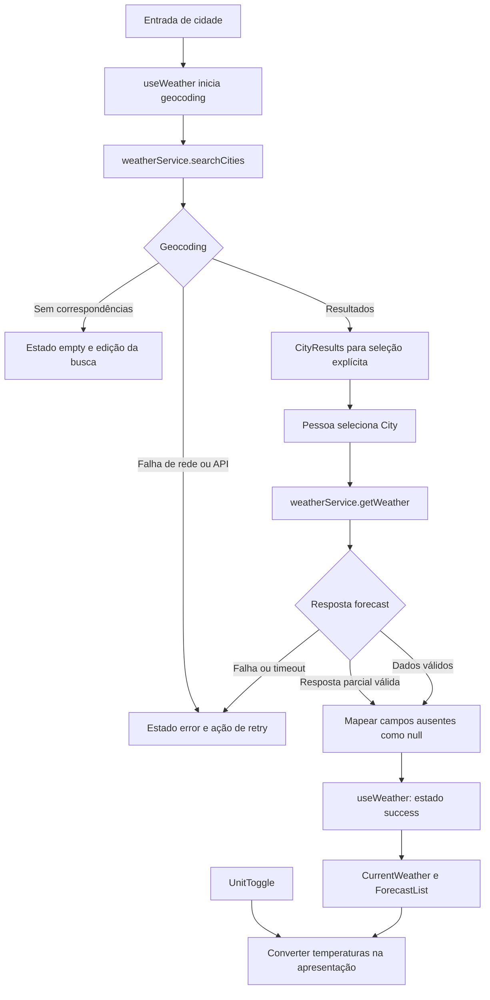

# Plano Técnico do Weather App

> Plano derivado de `specs/weather-app-spec.md`. A spec ainda tem decisões de
> produto em aberto; os itens identificados como proposta precisam de aprovação
> antes de serem tratados como contrato final para desenvolvimento.

## Architecture (Overview)

Aplicação SPA React com fluxo unidirecional e quatro responsabilidades simples:

- **Apresentação (`components/`):** busca, escolha de cidade, clima, previsão e
  estados visuais. Recebe dados e callbacks por props.
- **Orquestração (`hooks/`):** `useWeather` coordena busca, seleção, consulta,
  retry e estados da tela; mantém também a unidade selecionada.
- **Acesso a dados (`services/`):** funções assíncronas isolam `fetch`, URLs,
  validação básica e mapeamento das respostas da Open-Meteo.
- **Funções puras e contratos (`lib/`, `types/`):** conversão, formatação,
  códigos meteorológicos e tipos internos independentes do formato HTTP.

```text
React UI → useWeather → weatherService → Open-Meteo
    ↑            ↓             ↓
    └── estado e callbacks   tipos internos
```

O navegador consulta a API diretamente, sem servidor intermediário ou segredo
de API, coerente com a v1 estática e com a fonte escolhida. A dependência externa
fica confinada ao service para que os componentes não dependam dos contratos da
Open-Meteo.

## Tech Stack

| Camada | Tecnologia | Justificativa |
| --- | --- | --- |
| Linguagem | TypeScript strict | Contratos explícitos entre serviço, estado e UI. |
| Interface | React + Vite | SPA pequena, compatível com a configuração existente e deploy estático. |
| Estilos | Tailwind CSS | Segue a stack e o tema já definidos pelo projeto. |
| Dados | Open-Meteo Geocoding + Forecast | Fonte escolhida no discovery, sem chave de API. |
| Testes unitários | Vitest + Testing Library | Integração com Vite e testes de serviços, componentes e funções puras. |
| Testes E2E | Playwright | Valida o fluxo completo e viewports móveis. |
| Qualidade | Biome | Lint e formatação definidos pelo repositório. |
| Pacotes | pnpm | Gerenciador definido pelo projeto. |

Usar `fetch`, `AbortController` e estado React nativos. Não introduzir biblioteca
de estado ou cliente HTTP até existir necessidade comprovada.

## Project Structure

```text
src/
├── components/
│   ├── SearchBar.tsx            # entrada e envio da busca
│   ├── CityResults.tsx          # seleção entre locais encontrados
│   ├── CurrentWeather.tsx       # condições atuais da cidade
│   ├── ForecastList.tsx         # previsão diária
│   ├── ForecastCard.tsx         # resumo de um dia
│   ├── UnitToggle.tsx           # seleção Celsius/Fahrenheit
│   └── states/
│       ├── LoadingState.tsx
│       ├── ErrorState.tsx
│       └── EmptyState.tsx
├── hooks/
│   └── useWeather.ts            # estado e orquestração do fluxo
├── services/
│   └── weatherService.ts        # geocoding, forecast e mapeamento HTTP
├── lib/
│   ├── temperature.ts           # conversão C/F pura
│   ├── weatherCodes.ts          # código WMO para rótulo/ícone
│   └── format.ts                # datas, horários e unidades
├── types/
│   └── weather.ts               # contratos internos compartilhados
├── styles/
│   └── index.css                # estilos globais e Tailwind
├── App.tsx                      # composição da página
└── main.tsx                     # bootstrap React
```

Separar o acesso de rede permite mockar o service sem rede nos testes; manter
conversão e formatação em funções puras facilita testar regras sem renderizar UI.
`CityResults.tsx` é uma proposta para deixar a escolha de homônimos acessível e
separada do campo de busca; pode ser incorporada a `SearchBar` se a UI final for
simples o bastante.

## Data Model

Os campos meteorológicos abaixo são um contrato técnico proposto a partir das
variáveis disponíveis na Open-Meteo e dos riscos do discovery. A spec ainda não
define quais campos são obrigatórios; os valores podem ser `null` quando a fonte
não os retornar.

```ts
export type Unit = 'celsius' | 'fahrenheit';

export interface City {
  id: number; // Identificador retornado pelo geocoding.
  name: string; // Nome da localidade.
  country: string; // País para distinguir localidades homônimas.
  countryCode: string; // Código do país retornado pela fonte.
  admin1?: string; // Estado ou região, quando disponível.
  latitude: number; // Coordenada usada no forecast.
  longitude: number; // Coordenada usada no forecast.
  timezone?: string; // Fuso retornado pelo geocoding, se disponível.
}

export interface CurrentWeather {
  observedAt: string; // Horário da observação em formato ISO 8601.
  temperatureC: number | null; // Temperatura do ar, normalizada em Celsius.
  apparentTemperatureC: number | null; // Sensação térmica em Celsius.
  weatherCode: number | null; // Código WMO da condição atual.
  humidityPercent: number | null; // Umidade relativa em porcentagem.
  windSpeedKmh: number | null; // Velocidade do vento em km/h.
  pressureHpa: number | null; // Pressão à superfície em hPa.
  precipitationMm: number | null; // Precipitação do intervalo atual em mm.
}

export interface ForecastDay {
  date: string; // Data local da cidade no formato YYYY-MM-DD.
  minTemperatureC: number | null; // Mínima diária em Celsius.
  maxTemperatureC: number | null; // Máxima diária em Celsius.
  weatherCode: number | null; // Código WMO da condição diária.
  precipitationMm: number | null; // Precipitação total diária em mm.
  precipitationProbabilityPercent: number | null; // Probabilidade máxima diária.
}

export interface WeatherData {
  city: City; // Localidade selecionada pelo usuário.
  current: CurrentWeather; // Condições atuais dessa localidade.
  forecast: ForecastDay[]; // Cinco dias: hoje e os quatro seguintes.
}
```

**Unidades internas propostas:** armazenar temperaturas em Celsius, vento em
km/h, pressão em hPa e precipitação em mm. Converter somente temperaturas para
a unidade escolhida na apresentação. Os arredondamentos e a persistência da
unidade continuam pendentes na spec.

## Data Flow

1. A pessoa envia um nome de cidade; o hook inicia geocoding e a UI mostra
   carregamento.
2. O service normaliza a resposta e retorna `City[]`. Lista vazia produz estado
   `empty`; falha de rede/API produz `error`.
3. A UI apresenta os resultados com país e, quando disponível, região. A pessoa
   seleciona explicitamente uma cidade antes de consultar o clima.
4. O hook chama forecast com latitude e longitude da seleção. O service valida
   e mapeia os dados atuais e os arrays diários para `WeatherData`.
5. Em sucesso, os componentes recebem a cidade, condições e previsão via props.
   O toggle muda a unidade de UI e deriva temperaturas em renderização, sem novo
   request.
6. Erros recuperáveis mantêm a consulta necessária para permitir retry; valores
   parciais válidos são preservados e campos ausentes aparecem como
   indisponíveis, conforme AC-RF2.1.



## External APIs

As URLs são chamadas GET pelo navegador. O uso real, cobertura geográfica,
atribuição e termos da fonte ainda precisam ser validados conforme as perguntas
abertas da spec.

### Geocoding

```text
GET https://geocoding-api.open-meteo.com/v1/search
    ?name={query_url_encoded}&count=5&language=pt&format=json
```

- `name`: texto digitado, codificado como parâmetro URL.
- `count=5`: limita a lista inicial a cinco correspondências; validar se o
  limite serve à cobertura necessária.
- `language=pt`: solicita nomes em português quando disponíveis.
- `format=json`: resposta JSON.

Exemplo resumido de resposta:

```json
{
  "results": [
    {
      "id": 2267057,
      "name": "Lisbon",
      "latitude": 38.71667,
      "longitude": -9.13333,
      "country": "Portugal",
      "country_code": "PT",
      "admin1": "Lisbon",
      "timezone": "Europe/Lisbon"
    }
  ]
}
```

Mapear cada item de `results` para `City`; `country`, `country_code` e
`admin1` dão o contexto inicial de desambiguação. Confirmar com produto quais
campos de contexto serão apresentados. `results` ausente ou vazio deve resultar
em `empty`, não em erro de API.

### Forecast

```text
GET https://api.open-meteo.com/v1/forecast
    ?latitude={lat}&longitude={lon}
    &current=temperature_2m,apparent_temperature,relative_humidity_2m,weather_code,wind_speed_10m,surface_pressure,precipitation
    &daily=weather_code,temperature_2m_min,temperature_2m_max,precipitation_sum,precipitation_probability_max
    &temperature_unit=celsius&wind_speed_unit=kmh&precipitation_unit=mm
    &forecast_days=5&timezone=auto
```

- `latitude` e `longitude`: coordenadas da cidade explicitamente selecionada.
- `current`: variáveis propostas para clima atual; `surface_pressure` atende ao
  campo de pressão do contrato.
- `daily`: variáveis propostas para mínima, máxima, condição e precipitação.
- `temperature_unit=celsius`: mantém uma representação interna única.
- `wind_speed_unit=kmh` e `precipitation_unit=mm`: fixam as unidades internas.
- `forecast_days=5`: pede hoje e os quatro dias seguintes.
- `timezone=auto`: solicita os dias e horários no fuso da coordenada.

Exemplo resumido de resposta:

```json
{
  "timezone": "Europe/Lisbon",
  "current_units": {
    "time": "iso8601",
    "temperature_2m": "°C",
    "relative_humidity_2m": "%",
    "wind_speed_10m": "km/h",
    "surface_pressure": "hPa",
    "precipitation": "mm"
  },
  "current": {
    "time": "2026-10-07T12:00",
    "temperature_2m": 18.2,
    "apparent_temperature": 17.5,
    "relative_humidity_2m": 62,
    "weather_code": 2,
    "wind_speed_10m": 12.4,
    "surface_pressure": 1015.2,
    "precipitation": 0
  },
  "daily": {
    "time": ["2026-10-07", "2026-10-08"],
    "temperature_2m_min": [14.1, 13.8],
    "temperature_2m_max": [20.2, 21.0],
    "weather_code": [2, 3],
    "precipitation_sum": [0, 0.2],
    "precipitation_probability_max": [10, 20]
  }
}
```

O exemplo é esquemático e mostra dois itens para brevidade; a chamada configurada
para a aplicação deve retornar cinco. Mapear `current` campo a campo para
`CurrentWeather`. Os arrays de `daily` são paralelos: validar que têm o mesmo
comprimento e combinar os campos pelo índice em `ForecastDay[]`. Usar a data e
o fuso retornados pela API, sem recalcular o dia no fuso do navegador.

## State Management

Centralizar o fluxo no hook `useWeather`, no topo da composição em `App`, sem
biblioteca adicional. O hook expõe estado, cidades candidatas, cidade
selecionada, unidade e ações (`searchCity`, `selectCity`, `retry`, `setUnit`).
Componentes filhos recebem valores e callbacks por props.

Estados explícitos:

- `idle`: nenhuma busca iniciada.
- `loading`: chamada em andamento, com fase `geocoding` ou `forecast`.
- `selecting`: geocoding teve sucesso e há cidades para escolha; foi incluído
  para representar a decisão explícita exigida por RF1.
- `success`: forecast carregado para a cidade selecionada.
- `empty`: geocoding concluiu sem correspondências.
- `error`: falha de rede, HTTP, timeout ou resposta inválida, com informação de
  retry quando recuperável.

Guardar os valores meteorológicos na unidade canônica Celsius. `Unit` é estado
de apresentação, iniciado como `celsius`; alternar para Fahrenheit deriva
temperaturas com uma função pura de `lib/temperature.ts`, sem atualizar os dados
ou disparar outro request. Persistir a unidade entre visitas é uma pergunta
aberta e não deve ser presumido.

## Error Handling

O service distingue falha de transporte, status HTTP não bem-sucedido, timeout
e resposta incompatível. Retorna erros tipados ou lança erros normalizados que
o hook converte em estado `error`; não expõe stack trace nem detalhes internos
à UI.

| Situação | Comportamento planejado |
| --- | --- |
| Busca vazia ou geocoding sem resultados | Não consultar forecast; mostrar orientação para corrigir a busca em `empty`. |
| Cidades homônimas | Mostrar contexto de desambiguação e aguardar seleção. |
| Falha de rede, HTTP ou timeout | Terminar loading, explicar que os dados não carregaram e oferecer retry se recuperável. |
| Retry | Repetir o termo ou a cidade original; manter o contexto para não reiniciar o fluxo. |
| Resposta parcial válida | Manter campos válidos; mapear campos ausentes como `null` e identificá-los na UI como indisponíveis, nunca como zero. |
| Estrutura ou datas inconsistentes | Não apresentar valores como válidos; emitir erro normalizado e permitir retry quando fizer sentido. |
| Código meteorológico desconhecido | Usar rótulo neutro de condição desconhecida, sem falhar toda a previsão. |

Usar `AbortController` para cancelamento e timeout. O limite de tempo deve ser
configurável e aprovado; a spec ainda não define o valor. Cancelar buscas
anteriores ou ignorar respostas obsoletas para evitar que uma resposta lenta
substitua resultados de uma busca mais recente. Não definir cache nesta v1 sem
aprovação de idade máxima dos dados.

## Testing Strategy

### Vitest + Testing Library

- Funções puras: conversão Celsius/Fahrenheit, formatação por localidade e
  mapeamento de códigos WMO, incluindo código desconhecido.
- Service com `fetch` mockado: URL/parametrização, codificação do termo,
  geocoding com resultados e sem resultados, forecast com cinco dias, HTTP,
  falha de rede, timeout, resposta parcial e arrays diários inconsistentes.
- Hook: transições `idle`, `loading`, `selecting`, `empty`, `success` e `error`,
  seleção explícita e retry para a mesma busca/cidade.
- Componentes: loading, erro com retry, vazio, seleção de homônimos, sucesso,
  unidade/rótulos, campos indisponíveis, labels e operação por teclado.

### Playwright

- Fluxo de sucesso: buscar, selecionar, consultar condições, previsão e alternar
  unidade sem nova chamada de forecast.
- Busca vazia, cidade sem resultados, erro recuperável e retry.
- Homônimos: selecionar a opção correta e confirmar que seus dados são usados.
- Viewport móvel de 320 px e desktop, sem rolagem horizontal nem perda dos
  controles principais (RNF1).
- Acesso por teclado e nomes/estados acessíveis nos fluxos principais (RNF3).
- Interceptar as duas APIs com `page.route` e fixtures determinísticas; os testes
  não devem depender de rede ou disponibilidade externa.

## Risks & Trade-offs

| Decisão ou risco | Vantagem | Trade-off / mitigação |
| --- | --- | --- |
| Chamar Open-Meteo diretamente do browser | Mantém o deploy estático e não requer segredo de API. | Acopla disponibilidade ao provedor e exige validar CORS, termos, cobertura, atribuição e limites de uso. |
| Manter unidade canônica Celsius | Alternância não faz novo request e evita dados duplicados. | Conversões e arredondamento precisam de testes; a regra de arredondamento continua pendente. |
| Usar um hook React em vez de biblioteca de estado | Menos dependências para um fluxo de tela único. | Se telas ou fluxos crescerem, reavaliar divisão do estado; não antecipar essa complexidade. |
| Não adicionar cache na v1 | Evita apresentar dados antigos como atuais sem regra aprovada. | Repetir consultas depende da API; definir cache só após decidir idade máxima e atualização. |
| Forecast diário de cinco dias | Atende ao escopo atual e simplifica a UI. | Granularidade horária está fora do contrato definido e deve ser confirmada se necessária. |
| Resposta parcial com campos nulos | Preserva dados úteis sem inventar valores. | A spec precisa aprovar quais campos são essenciais e como a UI indica indisponibilidade. |
| Personas e requisitos operacionais não validados | Permite avançar com um plano preliminar. | Não aprovar o plano como base definitiva até as perguntas P3.7 serem respondidas ou formalmente aceitas. |

Riscos a acompanhar: adequação e termos da fonte externa, dados ou cidades
ambíguos, diferenças de fuso e respostas parciais, latência/indisponibilidade e
conversões incorretas. Medição das metas de 3 s e 99,5% depende da aprovação da
rede de referência e do modelo de disponibilidade (RNF5 e RNF6).

## Revisão do Plano (P4.8)

- **Cobertura funcional:** RF1 (busca, desambiguação e vazio), RF2 (clima atual e
  parcial), RF3 (cinco dias locais), RF4 (conversão sem novo request) e RF5
  (loading, falha e retry) têm decisões correspondentes em fluxo, estado,
  tratamento e testes.
- **Cobertura não funcional:** RNF1 (mobile), RNF2 (hierarquia e identificação
  local), RNF3 (teclado e acessibilidade), RNF4 (falhas), RNF5 (latência medida
  separadamente) e RNF6 (dependência monitorada) estão contemplados; limiares e
  matriz de suporte seguem pendentes conforme a spec.
- **Stack e instruções:** segue TypeScript, React, Vite, Tailwind, Open-Meteo,
  pnpm, Vitest, Testing Library, Playwright e Biome; mantém rede em `services/`,
  hooks em `hooks/`, tipos em `types/` e trata loading, erro, vazio e teclado.
- **Sem over-engineering:** não adiciona backend, autenticação, cache, cliente
  HTTP ou biblioteca de estado sem requisito que os justifique.
- **Pendências:** variáveis finais, contexto de geocoding, arredondamento,
  timeout, retenção local, termos/atribuição e aprovações operacionais devem ser
  confirmados antes de congelar os contratos. Exemplos de resposta deste plano
  são esquemáticos; não foram verificados por uma chamada HTTP nesta sessão.